# Vorschau: Eigene Gestalt und kurze Wege (APP-UX-001)

Fertiger Stand zum Ansehen. Claude legt diese Seite nach jeder Aufgabe neu in den
Austauschordner. Die Bilder liegen daneben in `belege/`, damit die Seite auch im
entpackten ZIP funktioniert.

- **Stand:** 09.10.2026, Branch `claude/crankscore-app-changes-nz88ir`, Commit `b7751b8`.
- **Nicht veröffentlicht:** Live bleibt Version 20261009-1047.
- **Online ansehen:** https://github.com/trostliam-hub/dreambuild/blob/claude/crankscore-app-changes-nz88ir/CrankScore-Austausch/VORSCHAU.md
- **Bericht:** `CLAUDE-ANTWORTEN.md` (APP-UX-001). **Prüfauftrag an Codex:** `CODEX-AUFTRAEGE.md` (APP-UX-001-N1).
- **Frühere Vorschau (3D-Beispielrad):** in `CLAUDE-ANTWORTEN.md` unter APP-3D-001. Die Bilder liegen weiter in `belege/APP-3D-001/`.

## Navigation: fünf beschriftete Bereiche

Aufbau · Prüfung · Fahrwerk · Upgrades · Einkauf. Am Handy unten, am Desktop neu oben unter dem Kopf.

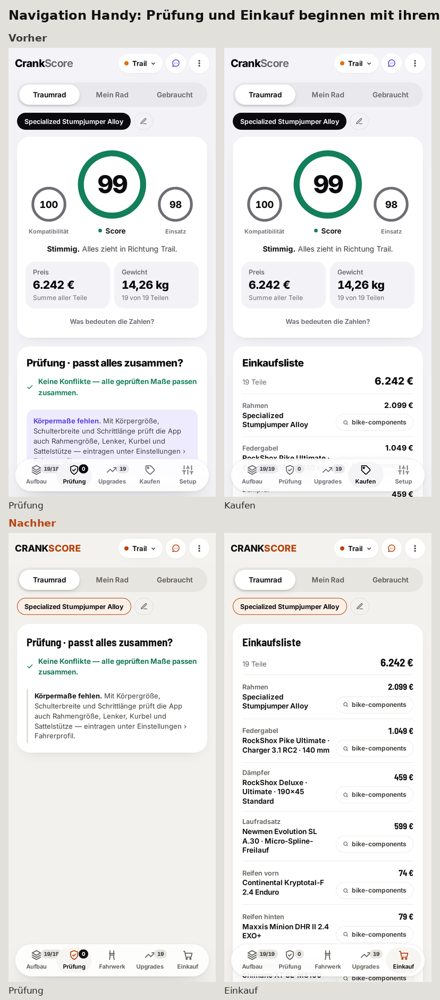

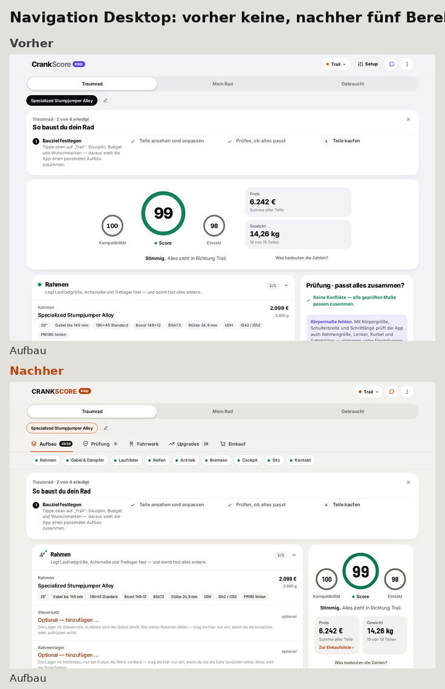

## Die Bereiche vorher und nachher

Am Handy steht der Score nur noch im Aufbau; die anderen Bereiche beginnen mit ihrem Inhalt.

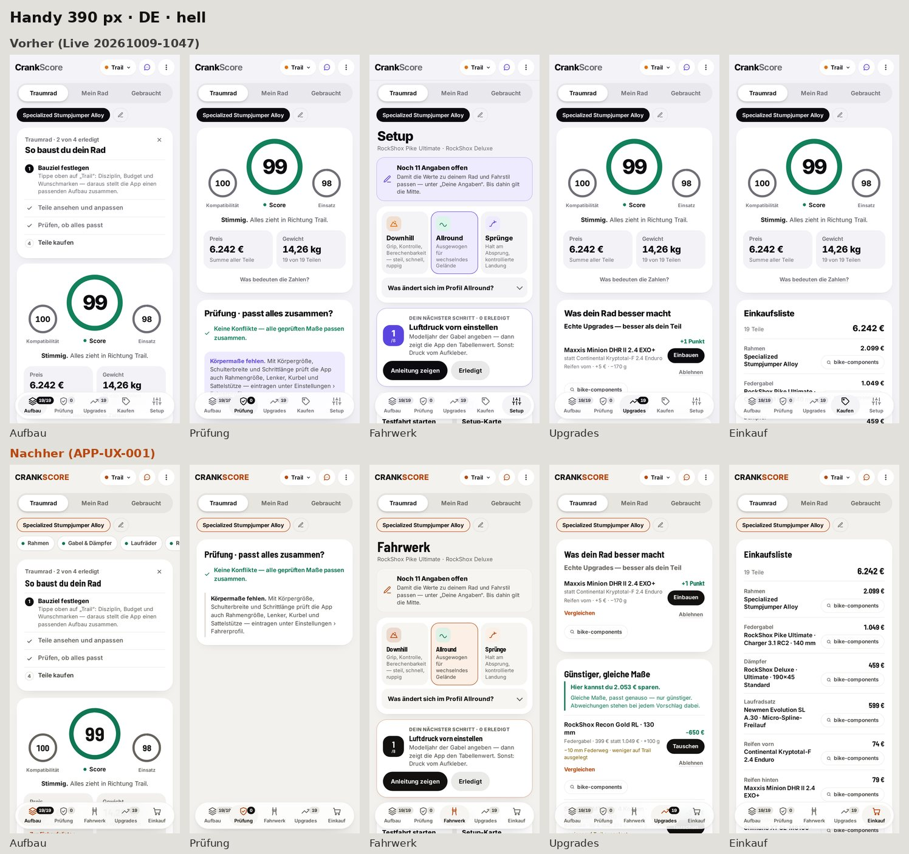

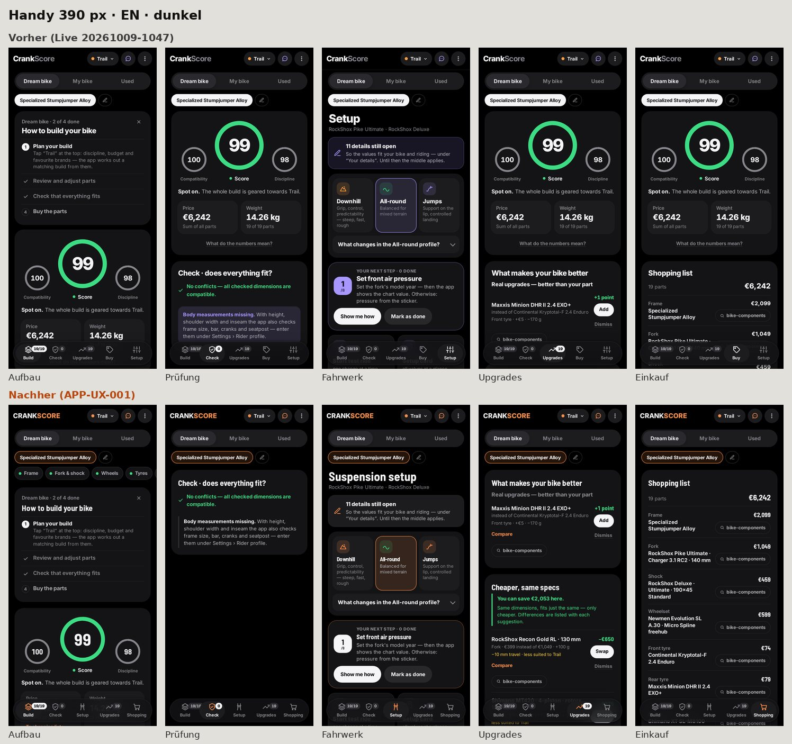

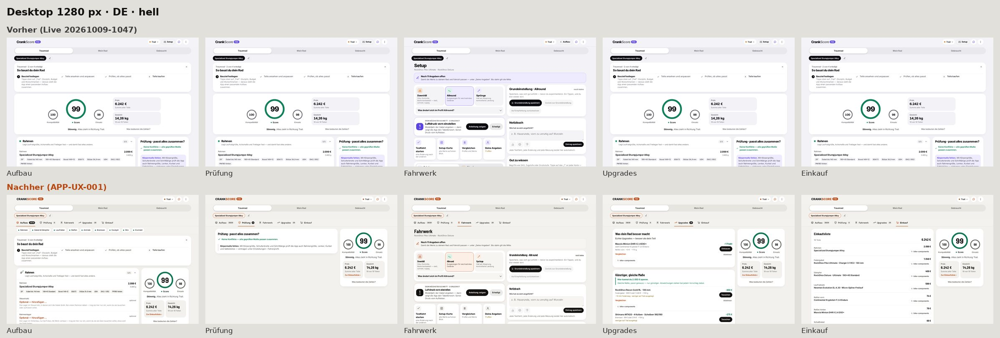

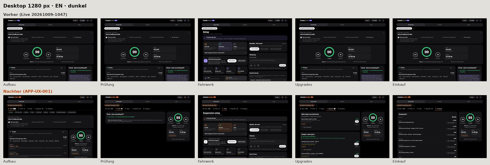

## Neue Wege am Bauteil

Vergleichen, Zurück zur Auswahl, Rad wechseln, Sprungleiste, Konfliktgrund am Teil:

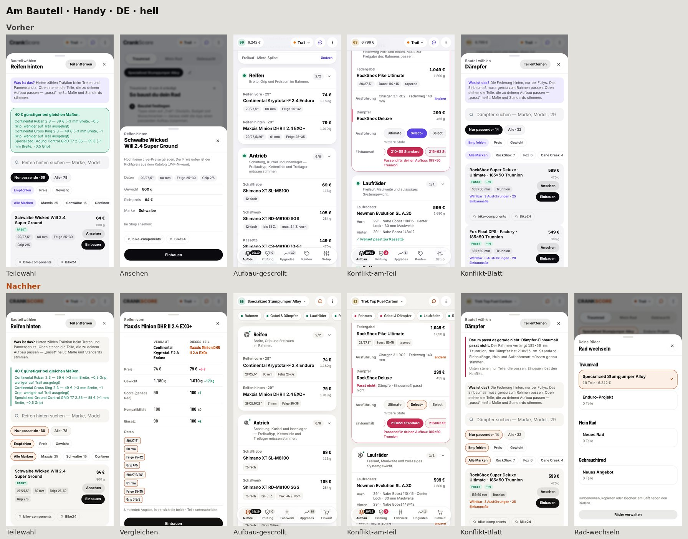

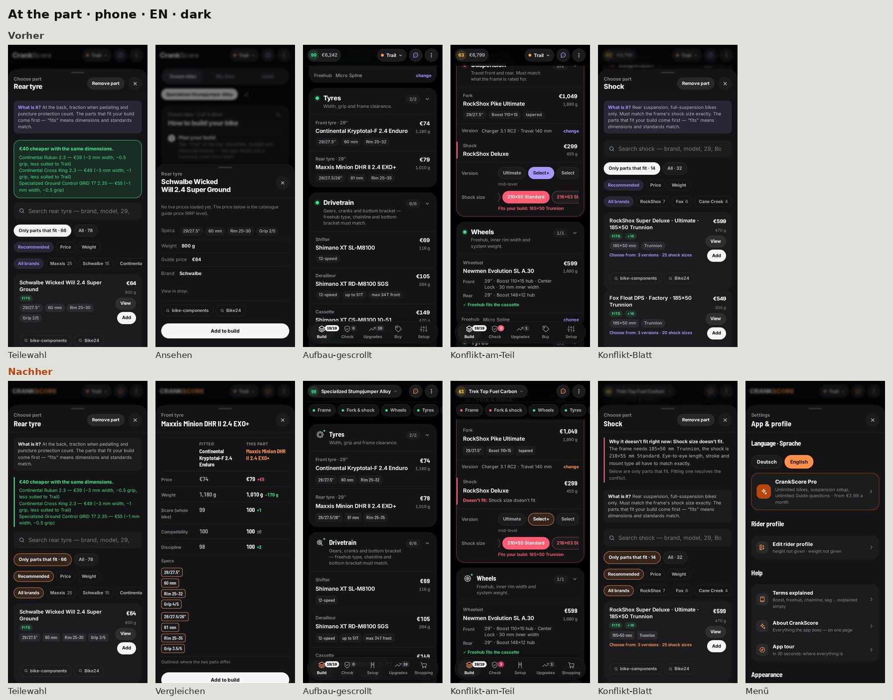

## Sechs Abläufe

| Ablauf | Handy vorher | Handy nachher | Desktop vorher | Desktop nachher |
|---|---|---|---|---|
| Bauteil finden und tauschen | 2 Tipps + 1.718 px Scrollen | 3 Tipps, 0 px | 2 + 1.237 px | 3, 0 px |
| Konflikt verstehen und beheben | 3 Tipps + 24 px | 2 Tipps, 0 px | 2 + 71 px | 2, 0 px |
| Fahrwerk öffnen | 1 („Setup“) | 1 („Fahrwerk“) | 1 (Kopf-Knopf) | 1 (Navigation) |
| Upgrade vergleichen | kein Vergleich; Umweg 4 + Eingabe + 1.741 px | 2 Tipps, 0 px | Umweg 2 + Eingabe + 886 px | 2, 0 px |
| Einkaufsliste aufrufen | 1 Tipp, 1 Zeile sichtbar | 1 Tipp, 5 Zeilen | 1 nach 3.793 px | 1, 0 px |
| Zwischen Rädern wechseln (weit unten) | 2 + 1.437 px, Bereich springt zurück | 4, 0 px, Bereich bleibt | 2 + 1.437 px | 4, 0 px |

Endbilder je Ablauf:

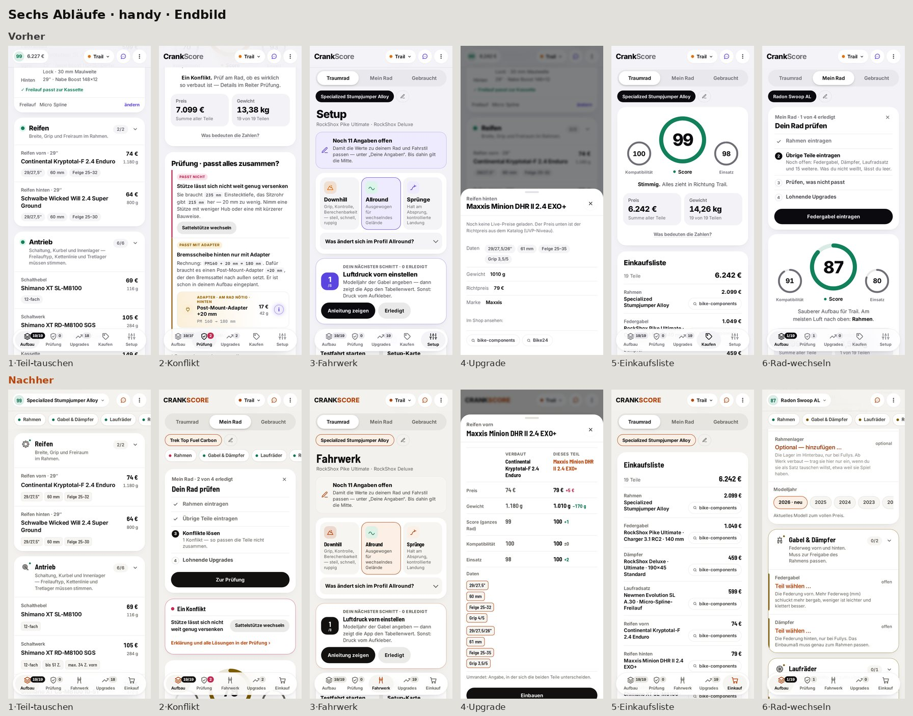

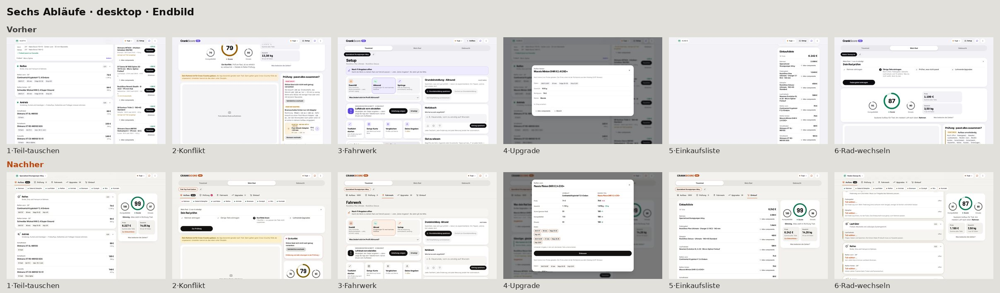

## Startseite und Schriftzug

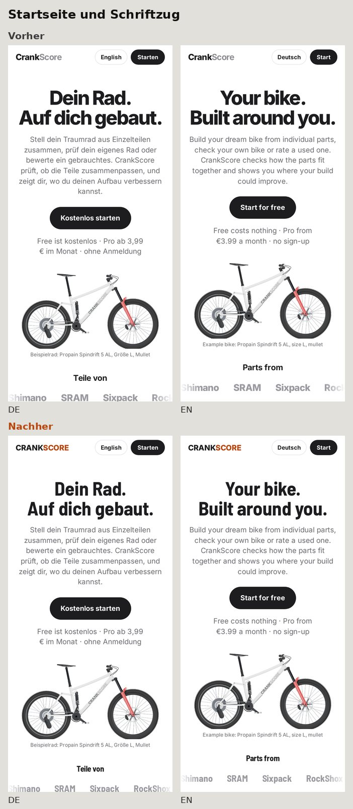
