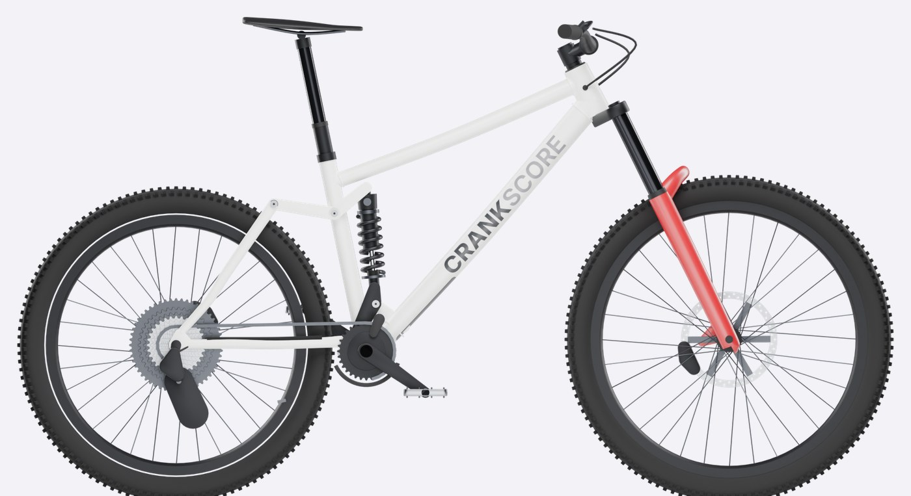
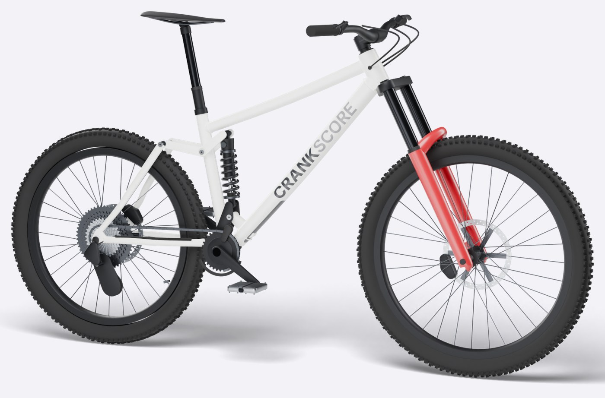
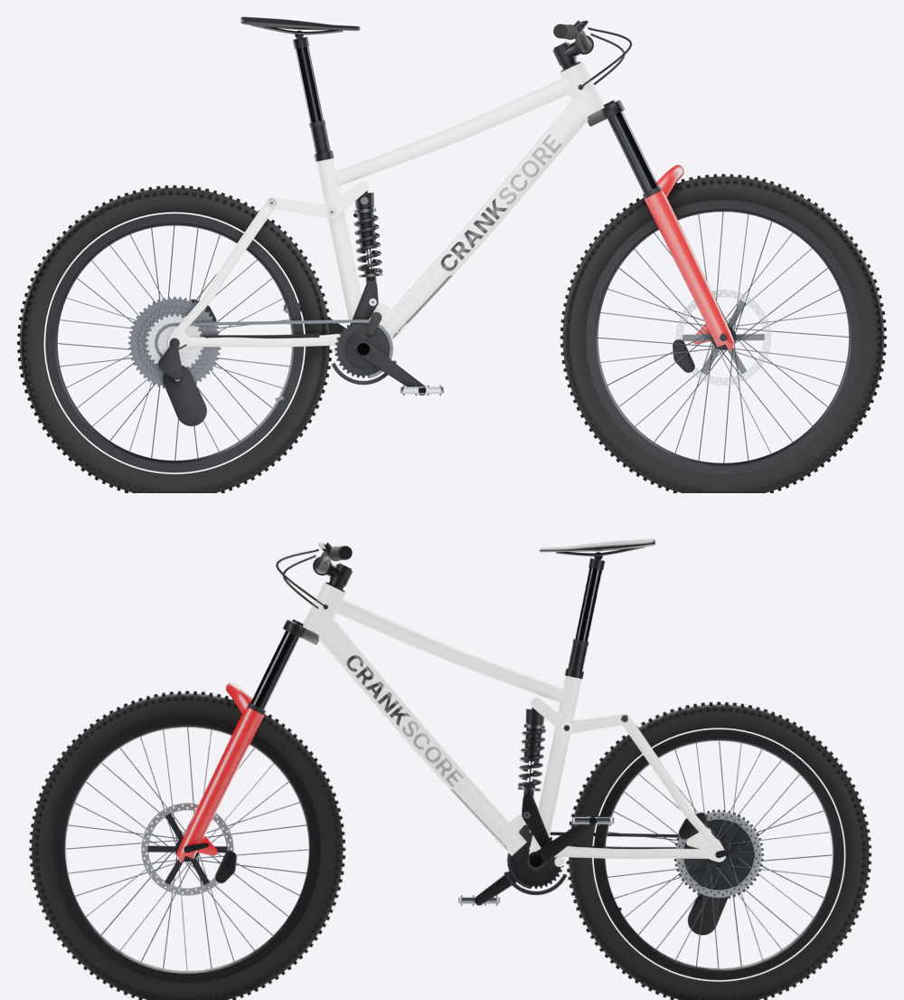
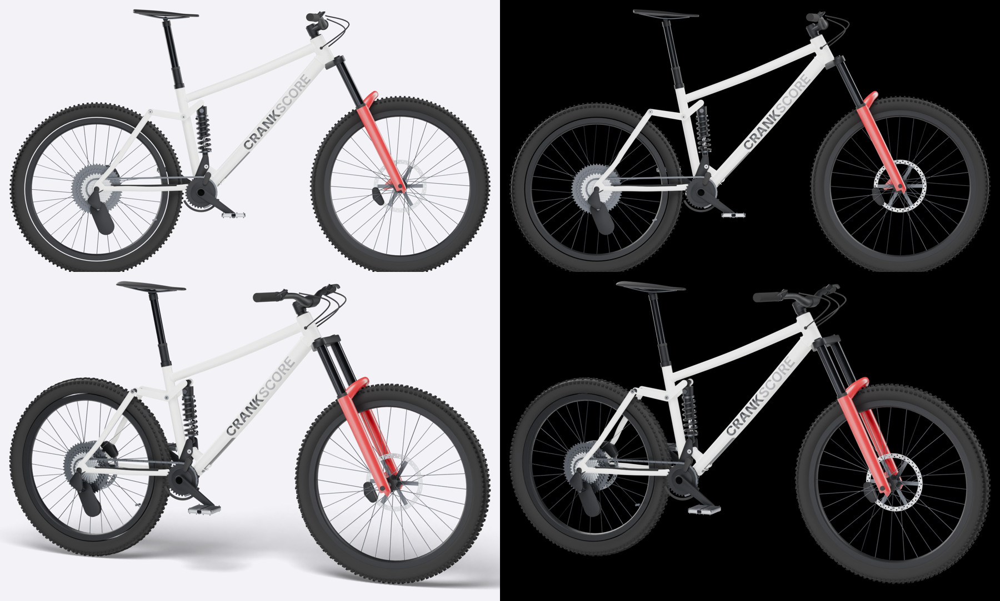
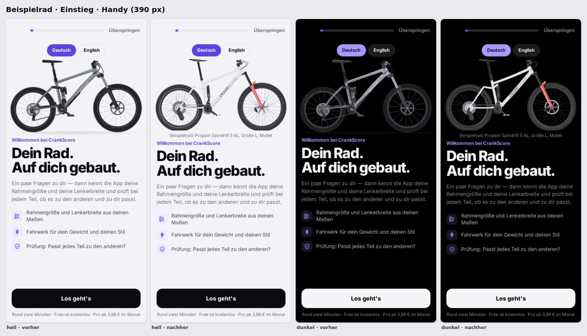
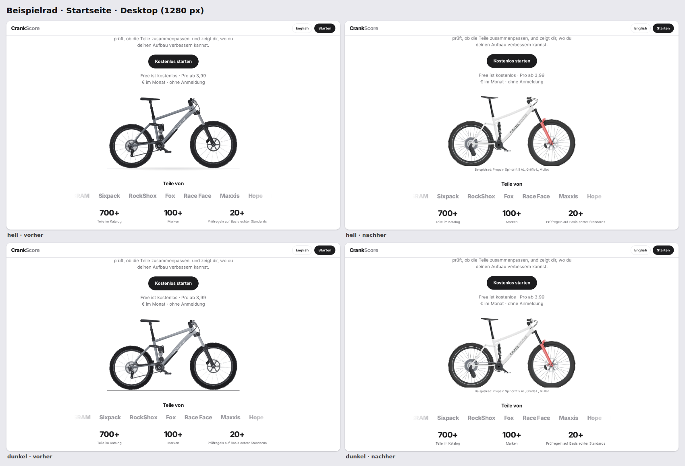
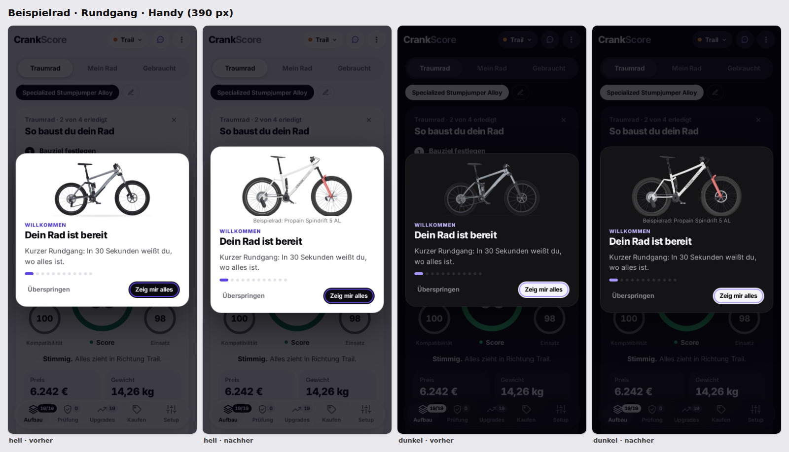
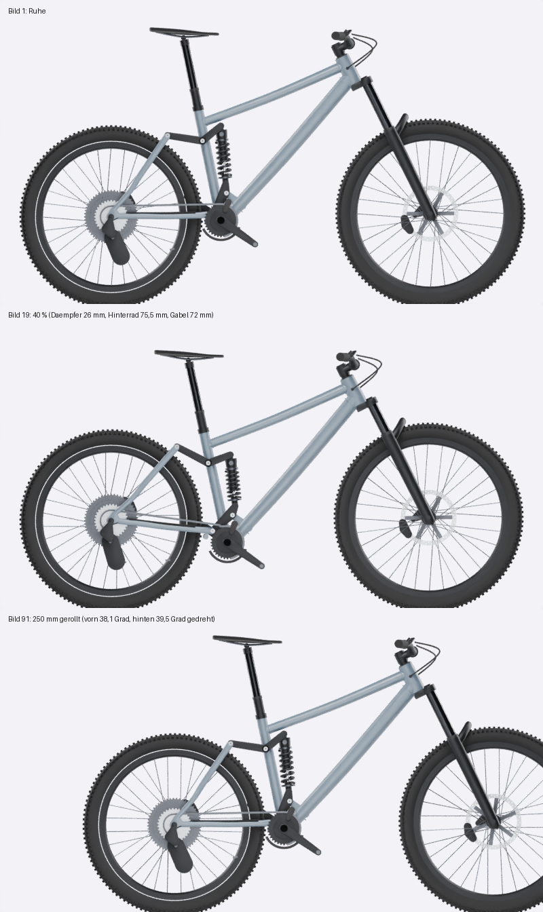
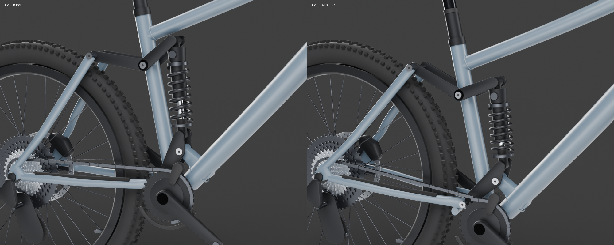

# Vorschau: 3D-Beispielrad (APP-3D-001)

Fertiger Stand zum Ansehen. Claude legt diese Seite nach jeder Aufgabe neu in den
Austauschordner; die Bilder liegen daneben in `belege/`, damit die Seite auch im
entpackten ZIP funktioniert.

- **Stand:** 09.10.2026, Branch `claude/crankscore-app-changes-nz88ir`. Nicht veröffentlicht; live bleibt Version 20261009-1047.
- **Online ansehen:** https://github.com/trostliam-hub/dreambuild/blob/claude/crankscore-app-changes-nz88ir/CrankScore-Austausch/VORSCHAU.md
- **Bericht:** `CLAUDE-ANTWORTEN.md` (APP-3D-001 und Nachträge) · **Prüfauftrag an Codex:** `CODEX-AUFTRAEGE.md` (APP-3D-001-N1)

## Das Rad

Nach Liams Vergleichsfoto: weißer Rahmen, rote Gabel, schwarze Anbauteile,
„CRANKSCORE“ auf dem Unterrohr. Geometrie: Propain Spindrift 5 AL, Größe L, Mullet
(29″ vorn, 27,5″ hinten), 180 mm Federweg.

## Beide Seiten mit Schriftzug

Auf der Antriebsseite liest „CRANKSCORE“ vom Tretlager zum Steuerrohr, auf der
anderen Seite wie auf dem Foto vom Steuerrohr nach unten.

## Auf hellem und dunklem Grund

## In der App (vorher / nachher)

Begrüßung am Handy:

Startseite am Desktop:

Erste Rundgang-Karte am Handy:

## Bewegung

Federn (40 % Hub) und Rollen. Die Bilder zeigen noch den grauen Lack; Geometrie und
Bewegung sind dieselben.

## Was stimmt, was geschätzt ist

- **Aus Tabellenwerten (laut Suchergebnissen, die Propain-Seite war für Claude gesperrt):**
  - Reach 480, Stack 644, Steuerrohr 110, Lenkwinkel 63,9°, Sitzwinkel eff. 78,7°
  - Kettenstrebe 435, Radstand 1264, Tretlagerhöhe 349, Dämpfer 230 × 65
- **Geschätzt:** die Drehpunkte des Hinterbaus.
  - 65 mm Dämpferhub ergeben im Modell 178,7 mm statt 180 mm.
  - Die Hebel drehen gleichsinnig; Propain beschreibt sie als gegenläufig.
- **Widerspruch in den Quellen:** Kettenstrebe 435 oder 445 mm, Radstand 1264 oder 1278 mm. Einzelheiten stehen in `../3d/README.md`.
- **Frei gestaltet:** Rohrquerschnitte, Knotenbleche und Hebelformen (keine Produktfotos zugänglich). Keine Markenlogos an Gabel, Felgen und Reifen.

## Dateien

- **3D-Modell (GLB, 0,87 MB):** https://raw.githubusercontent.com/trostliam-hub/dreambuild/claude/crankscore-app-changes-nz88ir/3d/modell/spindrift-5-al.glb
- **Bearbeitbare Blender-Datei (1,7 MB):** https://github.com/trostliam-hub/dreambuild/blob/claude/crankscore-app-changes-nz88ir/3d/modell/spindrift-5-al.blend
- **Maße, Quellen, Drehpunkte, Skripte:** https://github.com/trostliam-hub/dreambuild/tree/claude/crankscore-app-changes-nz88ir/3d
